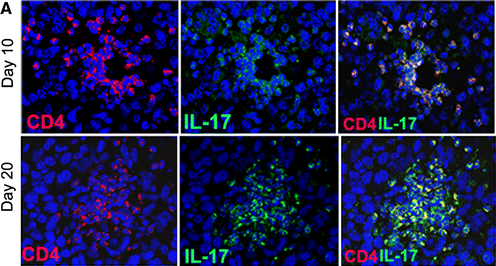
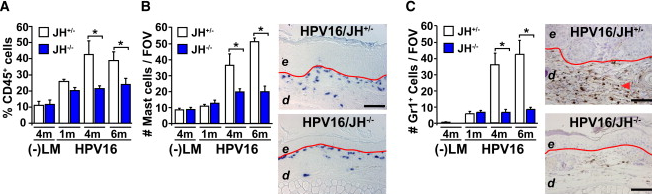

<!-- Limit image width and height -->
<style type="text/css">
img {     
  max-height: 480px;     
  max-width: 600px; 
  }
</style>

<style> 
.title-slide {
background-image:url(http://www.nature.com/mt/journal/v18/n2/images/mt2009228f2.gif);
background-repeat: no-repeat;
background-position: 0% 5%;
background-size: 44%;
background-color: #CBE7A5; /* ; ; */
}

.title-slide hgroup > h1{
 font-family: 'Oswald', 'Helvetica', sanserif; 
}

.title-slide hgroup > h1, 
.title-slide hgroup > h2 {
  color: #535E43 ;  /* ; #EF5150*/
}
</style>

<!-- Center image on slide -->
<script type="text/javascript" src="http://ajax.aspnetcdn.com/ajax/jQuery/jquery-1.7.min.js"></script>
<script type="text/javascript">
$(function() {     
  $("p:has(img)").addClass('centered'); 
});
</script>

<!-- Italic and Bold -->
<style>
em {
  font-style: italic
}
strong {
  font-weight: bold;
}

table {
  border: none;
  width: 100%;
  border-collapse: collapse;
  font-size: 12px;
  line-height: 18px;
  font-family: 'Trebuchet MS';
  font-weight: bolder;
  color: rgb(102, 102, 102);
}

.ninety {
  font-size: 90%;
   }

.fifty {
   font-size: 50%;
   }
</style>

--- .segue .dark .nobackground

## Recap

---

---&twocol

## Metastaasi potentsiaal on olemas algses vähis

Metastaseerumise põhjustavad samad onkogeensed stiimulid/geenid, mis põhjustasid ka algse vähi tekke


***=left

- Vähi metastaseerumise ennustab algse vähi geeniekspressioon.
- Rinnavähi halva prognoosi geenimuster sisaldab geene mis reguleerivad rakutsüklit, invasiooni ja angiogeneesi.

***=right


<footer class="source">Pilt:  Gene expression profiling predicts clinical outcome of breast cancer. 
<a href="http://www.nature.com/nature/journal/v415/n6871/full/415530a.html">van 't Veer et al., 2002.
</a>
</footer>

---&twocol

## Metastaaside organotropismi määravad faktorid


***=left

- Organ-spetsiifilist levikut määravad faktorid.
    - Vereringe muster.
    - Endoteeli omadused.
    - Ellujäämis niššid.

***=right

- Organ-spetsiifilist kolonisatsiooni määravad faktorid.
    - Latentsus ja reaktivatsioonisignaalid.
    - Stroomarakkude signalisatsioon.
    - Teraapia vastus.
    
<footer class="source">Pilt: Metastasis Steps and Bottlenecks. Sakari Vanharanta, Joan Massagué, 
<a href="http://www.cell.com/cancer-cell/fulltext/S1535-6108(13)00417-0">2013
</a>
</footer>

---

## Metastaasi mutatsioonid on samad mis primaarse vähiga seotud mutatsioonid

- Pankrease vähi metastaatilised kloonid sisaldavad **KRASG12V, MYC ja CCNE1** geenimutatsioone.
- Neeruvähi metastaasides on muteerunud **TP53, SETD2, KDM5C**.
- ER-positiivse rinnavähi patsiendil 9 a. peale primaarse vähi eemaldamist tekkinud metastaasides oli peamine mutatsioon **ERBB2** amplifikatsioon.

---&twocol

## Metastaasi signalisatsiooni eripärad

***=left

- Onkogeense signalisatsiooni amplifikatsioon (signaalirajad muutuvad tundlikumaks stimulatsioonile).
- Ekspressioonimärklaudade repertuaari laienemine (epigeneetilise regulatsiooni läbi).

***=right


<footer class="source">Pilt:  In triple-negative breast cancer examples include VCAM-1 and SRC as amplifiers of the PI3K pathway in cancer cells reaching the lungs or the bone marrow, respectively, whereas Tenascin C and Periostin act as amplifiers of the WNT and NOTCH pathways in cancer cells reaching the lungs. VCAM-1 can be engaged by α4β1 integrins on tumor-associated macrophages, leading to activation of ezrin, a PI3K and Akt adaptor protein
The expansion of target genes that the HIF pathway activates in renal cell carcinoma as a result of epigenetic modifications that open the gene promoters to access by activated HIF
<a href="http://www.cell.com/cancer-cell/fulltext/S1535-6108(13)00417-0#">
Sakari Vanharanta, Joan Massagué, 2013.
</a>.
</footer>

--- .segue .dark .nobackground

## Vähi immuunsus ja immuunoteraapia

---&twocol

## Vähi immuunoseire
# *Cancer immunosurveillance*

- 1909. aastal oletas saksa-juudi päritolu arst [Paul Ehrlich](http://en.wikipedia.org/wiki/Paul_Ehrlich) (1854-1915) et immuunsüsteem hoiab ära kartsinoomide tekke, mis vastasel juhul oleksid palju sagedasemad.
- Vähi immuunoseire hüpotees oletas, et tüümusest pärit rakud monitoorivad keha kudedes ka uusi transformeerunud rakke [Frank Macfarlane Burnet, 1970](http://www.ncbi.nlm.nih.gov/pubmed/4921480).

***=right


***=left


<footer class="source">Pilt: wikipedia.
</footer>

---

## Vähi immuunokujundamine
# *Cancer immunoediting*

- Alternatiivseks hüpoteesiks vähirakkude ja immuunsüsteemi interaktsioonide kirjeldamiseks on **vähi immuunokujundamise**.
- Vähi **täielik elimineerimine immuunsüsteemi poolt** on immuunokujundamise üks stsenaarium. 
- Teine stsenaarium on **immuunsüsteemi poolt kujundatud vähirakkude** repertuaari esiletõus. 
- Immuunsüsteemiga kohandunud vähirakud on kas 
  - **vähem immuunogeneesed**,
  - suurenenud **võimega inhibeerida vähivastast immuunvastust**.

---

## Vähi immuunoseire/-kujundamine
# Vähi immuunoseire või -kujundamise toimimisele inimeses viitavad

- Kõrgem vähi intsidents immuunosupressiivset ravi saavatel organi transplantatsiooni läbinud patsientidel.
- Vähipatsientidel tekib oma vähi vastu immuunvastus.
- Vähisiseste tsütotoksiliste (CD8+) ja immuun-protektiivsete regulatoorsete (CD25+Foxp3+) T rakkude lokalisatsioon.

---&twocol

## Kõrgem vähi intsidents immuunosupressiivse ravi puhul

- Organi transplantatsiooni läbinud patsiendid saavad tugevat immuunosupressiivset ravi.

***=left

```{r,echo=FALSE,results='asis',fig.width=4.5,fig.height=5}
library(ggplot2)
trans<-data.frame(Arv=c(13372,4954,2198,956,911,435,79,48),
Organ=c("neer","maks","süda","kops",
         "neer ja\nkõhunääre","kõhunääre","sool","süda ja\nkops"))
qplot(reorder(Organ,Arv),(Arv/sum(Arv))*100, 
      data=trans, geom="bar",stat="identity") + 
  xlab("Transplanteeritud organ") + ylab("% transplantatsioonidest") +
  ggtitle("Organ-spetsiifilised transplantatsioonid\nUSA-s 2000. aastal (N = 22,953 patsienti)")
```
***=right

Nahavähi populatsioon-standardiseeritud intsidents organi transplantatsiooni patsientidel (Norra ja Holland).

Nahavähk | intsidentsi kasv
---------|-----------------
SCC	| 65-korda
huule SCC |	20-korda
BCC	| 10-korda
melanoom |	3.4-korda
Kapoosi sarkoom |	84-korda


<footer class="source">Graafik: Transplant Patient DataSource. United Network for Organ Sharing. Tabel: 
<a href="http://www.ncbi.nlm.nih.gov/pubmed/2316011">Hartevelt et al., 1990.
</a>
<a href="http://www.ncbi.nlm.nih.gov/pubmed/10642700">Jensen et al., 2000.
</a>
Lisaks: 
<a href="http://www.hudlaeknastodin.is/resources/Um-okkur/BS/Ca_Org_transpl.pdf">Lindelöf et al., 2000.
</a> ja 
<a href="http://www.sciencedirect.com/science/article/pii/S0190962202000117">Berg & Otley, 2002.
</a>
</footer>

----
# Vähi intsidents organi transplantatsiooni patsientidel

```{r cancer_immunosuppressed_pts, echo=FALSE, results='asis'}
transplants <- read.table(
textConnection("site, observed, expected
'non melanoma skin', 127, 5.1
'thyroid other endocrine', 30, 2.1
'mouth tongue lip',22,1.6
'cervix vulva vagina',39,3.6
'non-Hodgkins lymphoma',25,2.4
'kidney ureter',32,3.5
'bladder',26,4.7
'colorectal',38,10.5
'lung',30,12.5
'brain',10,4.1
'prostate',11,5.2
'melanoma',7,4.1
'breast',15,13.6")
, header = T, sep = ",")

library(dplyr)
transplants <- transplants %>% mutate(ratio = expected/observed)

library(MASS)
params <- fitdistr(transplants$ratio, densfun = "beta", start = list(shape1 = 0.8, shape2 = 2))$estimate

trcan <- transplants %>% mutate(eb_ratio = (expected + params[1])/(observed + params[1] + params[2]),
                       eb_increase = round(1/eb_ratio, 1)) %>% 
  dplyr::select(site, observed, expected, eb_increase)
library(knitr)
kable(trcan, col.names = c("Site of cancer", "No. cases observed", "No. cases expected", "Ratio obs/exp (adj)"))
```

<footer class="source">Tabel: [Peto, J (2001)](http://www.nature.com/nature/journal/v411/n6835/full/411390a0.html). Cancer epidemiology in the last century and the next decade. Nature, 411, 6835:390-5.
[Birkeland, et al. (1995)](http://onlinelibrary.wiley.com/doi/10.1002/ijc.2910600209/abstract). Cancer risk after renal transplantation in the Nordic countries, 1964-1986. Int. J. Cancer, 60, 2:183-9. ADJustment by empirical Bayesian shrinkage towards a Beta prior.
</footer>

---&twocol

## Immuunpuudulikel hiirtel tekib rohkem kasvajaid

***=right


***=left

- Metsik tüüpi või RAG2 -/- hiirtele süstiti naha alla 100 $\mu$g  kartsinogeenset 3-metüülkolantreeni (*methylcholanthrene*, MCA) ja jälgiti vähiteket.
- 160 päeva pärast oli 9/15 RAG2-/- hiirel moodustunud MCA-indutseeritud vähid, samas oli sama moodi indutseeritud vähk tekkinud ainult 2/15 wild-type hiirel.
- RAG2-/- hiirtel puuduvad T-, B- ja NK-T rakud.

<footer class="source">Pilt: IFNbig gamma and lymphocytes prevent primary tumour development and shape tumour immunogenicity.
<a href="http://www.nature.com/nature/journal/v410/n6832/full/4101107a0.html">
Shankaran et al., 2001.
</a>
</footer>

---&twocol

# Vähid mis tekivad hiires kellel puuduvad lümfotsüüdid on immunogeensemad

***=right


***=left

- Immuunopuudulikele RAG2-/- hiirtele või metsik tüüpi hiirtele transplanteeriti naha alla 100'000 vähirakku, mis pärinesid RAG2-/- või wt hiirtest eraldatud MCA-indutseeritud tuumoritest.
- Süngeensetest wt hiirtest pärit 17 erineva vähi rakud moodustasid tuumoreid 100% (17/17) wt hiirtes.
- RAG2-/- hiirtest pärit vähirakud (20  erinevast tuumorist) moodustasid tuumoreid ainult 40% juhtudest (8/20) kui neid transplanteeriti sama geneetilise tagapõhjaga imuunkompetentsetele hiirtele.

<footer class="source">Pilt: IFNbig gamma and lymphocytes prevent primary tumour development and shape tumour immunogenicity.
<a href="http://www.nature.com/nature/journal/v410/n6832/full/4101107a0.html">
Shankaran et al., 2001.
</a>
</footer>


---

## Kas rakulised onkogeenid on immunogeensed?

- Mutantsete vähi ja normaalsete valkude erinevused on väikesed: RAS, TP53, BCR-ABL.
- Trioosfosfaat isomeraas (glükolüüsi rada) on mitmetes vähkides immunogeenne.
- Mutantse RAS valgu struktuur ei ole muutunud (nt. KRASG12V vs. wt KRAS), madal immunogeensus ja lisaks on onkogeensed RAS valgud madalalt ekspresseeritud.

---

## Vähis võib tekkida immuunvastus kõrgelt ekspresseeritud valkude vastu

- hTERT on üleekspresseeritud 70-80% vähkides. Maksakartsinoomi patsientidel hTERT-vastased antikehad veres. Nende antikehade roll progressioonis ebaselge.
- HER2/neu positiivsed rinnakartsinoomid, seal 10-20x üleekspressioon (trastuzumab).
- GD3 gangliosiid (siaalhapet sisaldav glükosfingolipiid) on mitmetes vähkides (melanoon sh.) üle ekspresseeritud.

---- 
# Inimese GI vähi mutatsioonide immunogeensus

```{r somatic_mut_immunogenicity, echo=FALSE, results='asis',size=3}
# Immunogenicity of somatic mutations in human gastrointestinal cancers
# Originally published in Science Express on 29 October 2015, doi: 10.1126/science.aad1253
# Science 11 December 2015: vol. 350 no. 6266 1387-1390

library(rvest)
tdist <- read_html("http://www.sciencemag.org/content/350/6266/1387/T1.expansion.html")
crc <- tdist %>% html_node("#table-1") %>% html_table(header = TRUE) %>% dplyr::select(1:3,8:11)
colnames(crc) <- c("ID","Age/sex","Tumor","Mutated prot","Aa change","T cell type","% in tumor")
kable(crc)
```

<footer class="source">Tabel: Mutation-reactive T cells in metastatic GI cancers [Tran, et al., (2015)](http://www.sciencemag.org/content/350/6266/1387/T1.expansion.html) Immunogenicity of somatic mutations in human gastrointestinal cancers. Science 11 December 2015: Vol. 350 no. 6266 pp. 1387-1390
</footer>

---&twocol

## Immuunrakud kasvaja mikrokeskonnas

***=right

- T lümfotsüüdid
- B lümfotsüüdid
- NK ja NKT rakud
- makrofaagid
- müeloidset päritolu suppressor-rakud
- dendriitrakud
- neutrofiilid

***=left


<footer class="source">Pilt www.nature.com
</footer>

---&twocol

## Kasvajasse infiltreeruvad erinevad T-raku populatsioonid


***=left

- lokaliseeruvad kasvaja välispiirile
- lähimasse lümfisõlme
- kasvaja stroomasse - tsütotoksilised T-rakud
 
***=right
 

 

<footer class="source">Pilt: 
<a href="http://cancerres.aacrjournals.org/content/71/17/5670.long"> Halama et al. (2011).
</a>
</footer>

--- &twocol

## T-lümfotsüüdid 

***=left

- tsütotoksilised mälu T (CD8+CD45RO+),
- Th1 (partnerrakud: makrofaagid, CD8+ T),
- Th2 (partnerrakud: B, eosinofiilid, nuumrakud),
- Th17 või
- Treg rakkudeks

***=right


<footer class="source">Pilt: 
<a href="http://www.nature.com/nrc/journal/v12/n4/full/nrc3245.html"> Fridman et al., 2012.
</a>
</footer>

---

## Soolevähis on vähi T-rakud seotud hea prognoosiga
# Totaalne CD3+ T


<footer class="source">Pilt: B, valge tulp mitte-relapseeruv vähk, must tulp relapseerunud. 
<a href="http://www.sciencemag.org/content/313/5795/1960.full"> Galon et al., 2006.
</a>
</footer>

---

## Th1, CTL ja mälu-T

Anti-tumorigeensed - selgelt assotseeruvad hea prognoosiga

# TH1 
- produtseerivad IL-2 ja INF$\gamma$,
- toetavad kasvajale tsütotoksilisi CD8+ mälu T-rakke (CD8+CD45RO+).

# CTL 
- CD8+ tsütotoksilised T-rakud
- põhjustavad apoptoosi tsütotoksiliste graanulite (perforiin, granzyme) eritamise teel.


---

## Cytotoxic T Cells on Patrol

<iframe width="640" height="390" src="https://www.youtube.com/embed/cJU7ZaWe5-o?t=28" frameborder="0" allowfullscreen></iframe>

--- &twocol
## Th2 & Th17
Enamasti kasvaja arengut võimendav effekt

***=left

- **TH2** produtseerivad IL-4, IL-5 ja IL-13 ja
- toetavad B-rakkude aktivatsiooni
- sekreteerivad immunosuppressiivset IL-10

- **TH17** polarisatsiooni indutseerivad TGF-$\beta$ ja IL-6
- IL-17A, IL17F, IL-21 ja IL-22
- bakteriaalse põletiku vastus

***=right


<footer class="source">Pilt: Ye, J, Livergood, RS, Peng, G (2013). The role and regulation of human Th17 cells in tumor immunity. Am. J. Pathol., 182, 1:10-20.
</footer>

---&twocol

## Pahaloomulistes kasvajates on rohkem Th17 rakke

TH17-infiltreerumine on pahaloomulistes kasvajates tavaline:

***=left

- näo-lõualuu kasvajad, [Kesselring et al. (2010)](http://www.nature.com/bjc/journal/v103/n8/full/6605891a.html)
- rinnakasvajad, [Yang et al. (2011)](http://link.springer.com/article/10.1007/s12013-011-9276-3/fulltext.html)
- neerukasvajad, [Attig et al. (2009)](http://cancerres.aacrjournals.org/content/69/21/8412.full)
- glioomid, [Wainwright et al. (2010)](http://www.plosone.org/article/info%3Adoi%2F10.1371%2Fjournal.pone.0015390)
- medulloblastoomid, [Cantini et al. (2011)](http://link.springer.com/article/10.1007/s00262-011-1069-4/fulltext.html)

***=right



<footer class="source">Pilt: Cantini et al. (2011)
</footer>

--- &twocol

## Th17 pro-tumorigeensed mehhanismid
 
***=right

- **Angiogenees**: indutseerivad VEGF-i ekspressiooni.
- **Indutseerivad neutrofiilide invasiooni**
  - ECM-i lagundamine
  - immunosuppressioon.

***=left


<footer class="source">Pilt: 
<a href="http://www.bloodjournal.org/content/bloodjournal/101/7/2620.full.pdf?sso-checked=true"> Numasaki et al., 2002.
</a>
</footer>

---

## Immuunosuppressiivsed Treg rakud

Kõige sagedamini kirjeldatud pro-tumorigensete omadustega CD4+ rakud

 
- iseloomulik FOXP3 ja CD25 ekspressioon
- immuunosupressiivne funktsioon on vahendatud üle
    - TGF-$\beta$ ja IL-10 sekretsiooni ja
    - CTLA4-vahendatud kontaktinhibitsiooni.


<footer class="source">Pilt:
<a href="http://www.nature.com/nm/journal/v18/n5/fig_tab/nm.2731_F2.html">
Holgate, 2012.
</a>
</footer>

---

## B rakud
# Humoraalne immuunsus reguleerib lamerakulise nahakartsinoomi arengut

Hiire K14-HPV16JH-/- nahakartsinoomi mudel kus on B rakkude teke "välja lülitatud".

- FcR$\gamma$ aktivatsioon lükkab tagant põletiku põhjustatud kartsinogeneesi.
- B rakkude poolt sekreteeritavate autoantikehade akumulatsioon stroomas aktiveerib üle FcR$\gamma$ retseptori nuumrakud (sekreteerivad histamiini, hepariini) [Andreu et al. (2010)](http://www.sciencedirect.com/science/article/pii/S1535610809004310)
- FcR$\gamma$ reguleerib ka makrofaagide angiogeneetilist ja protumorigeenset toimet.



<footer class="source">Pilt: Andreu et al. (2010).
</footer>

---

# FcR$\gamma$ reguleerib ka makrofaagide angiogeneetilist ja protumorigeenset toimet.


<footer class="source">Pilt: Mantovani, 
<a href="http://www.sciencedirect.com/science/article/pii/S1535610810000358">
2010
</a>.
</footer>


---&twocol

## NK rakud

***=left

# Kasvajas on NK rakud anergilised

- anergia ilmselt vahendatud läbi kasvaja TGF-$\beta$
- pole aktiveeritavad isegi IL-2 poolt,
- ei sekreteeri INF$\gamma$.


# NK rakkude märklauaks

- sellised rakud mille pinnalt **puuduvad MHC-I molekulid** (MHC-I puudumine hoiab samas ära CTL vastuse) ja 
- rakud mis ekspresseerivad oma pinnal **NKG2D ligandi MICA või RAE**.


***=right


---&twocol

## NKG2D ja ligandid
# NKG2D on aktivatsiooniretseptoriks NK rakkudel

***=left


***=right

- NKG2D ekspr. vastusena stressile või DNA kahjustustele, samuti konstitutiivselt vähirakkudel.
- NKG2D ligandid on MICA/B ja RAE valgud
- MICA seostumine NKG2D-le aktiveerib NK rakud
- RAE üleekspressioon hiires muudab need loomad vastuvõtlikumaks kartsinogeneesile.
- Inimese kartsinoomid ja melanoomid üleekspresseerivad lahustuvat MICA ligandi (tekib proteolüütilise lõikamise teel, *shedding*)

<footer class="source">Pilt: Nature Immunology.
</footer>

---

## KIR *killer inhibitory receptor*
# NK vastust vähile reguleerib signaalide tasakaal

- KIR *killer inhibitory receptor* blokeerib MHC-I molekuliga interakteerudes NK rakkude vastuse.
- Rakud millel puuduvad MHC-I molekulid vallandavad NK-vastuse ja tapetakse.
- Osadel kasvajatüüpidel on MHC-I puudumine seotud parema vastusega.


---

## Kasvaja makrofaagid

Makrofaagid võivad diferentseeruda kahes suunas: 

# **tüüp 1 (M1)**

- vastusena bakteriaalse infektsioonile (LPS) ja 
- Th1 sekreteeritavale INF-$\gamma$ muutuvad aktiivselt fagotsüteerivateks rakkudeks, suunatud ka vähirakkude vastu;

# **tüüp 2 (M2)**, 

- vastusena hüpoksiale ja vähi poolt sekreteeritud tsütokiinidele IL-4, IL-10, IL-13 või
- TGF-β ja prostaglandiin E2 diferentseeruvad makrofaagid immuunosupressiivseteks ja 
- sarnaselt Th2 rakkudele hakkavad Th1-supresseerivaid tsütokiine tootma (IL-10 ja IL1$\beta$).

---

## TGF-β mehhanismid vähi immuunsupressioonis 

- TGF-β blokeerib interleukiin 2 ekspressiooni (IL-2). IL-2 aktiveerib T rakke, NK rakke jt. immuunrakke.
- TGF-β inhibeerib T rakkude jagunemist (p15 ja p21 läheb ülesse ning c-myc, CDK2/E alla).
- TGF-β inhibeerib tsütotoksiliste T rakkude aktivatsiooni, supresseerides IFN-γ ja perforiini ekspressiooni.
- TGF-β inhibeerib graanulite eksotsütoosi ja CD8+ T rakkude tsütolüütilisi funktsioone.
- TGF-β soodustab regulatoorsete T rakkude teket (Treg). Vähipatsientidel on neid tihti rohkelt.
- Füsioloogiline roll, hiirtel kellel puudub TGF-β1 (TGF-β1−/−) areneb välja multifokaalne põletikuline haigus, mis on tingitud kõrgenenud tsütokiinide produktsioonist.

---

## *Programmed death-1* vähi immunsupressioonis

- Vähirakud suruvad adaptiivse immuunvastuse alla ka selleläbi, et reguleerivad ülesse **PD-1 ligandi (PD-L1)**.
- PD-1L on vähirakkudel konstitutiivselt ekspresseeritud.
- PD-L1 seostumine antigeen-spetsiifilistele CD8+ T rakkudel olevale PD-1 retseptorile surub alla nende T rakkude effektor funktsioonid (rakkude tapmine).
- Sarnaselt immuunsupressiivselt toimib ka vähirakkudel jt. keharakkudel ekspresseeritav CTLA-4


<footer class="source">Pilt: Vähi checkpoint teraapia.
<a href="http://www.nature.com/news/antibody-alarm-call-rouses-immune-response-to-cancer-1.10784">
Hayden, 2012.
</a>
</footer>

---

## Kasvaja immuunkontekst


<footer class="source">Pilt:
<a href="http://www.nature.com/nrc/journal/v12/n4/full/nrc3245.html">
Fridman et al., 2012.
</a>
</footer>

--- .segue .dark .nobackground

## Lingid teistele loengutele

--- &twocol 

***=left 

- [Sissejuhatav loeng](http://tpall.github.io/sissejuhatus)
- [Vähitüübid](http://tpall.github.io/Vahityybid)
- [Onkoviirused](http://tpall.github.io/Onkoviirused)
- [Onkogeenid](http://tpall.github.io/Onkogeenid)
- [Retseptorid](http://tpall.github.io/Retseptorid)
- [Signaalirajad](http://tpall.github.io/Signaalirajad)
- [Tuumorsupressorgeenid](http://tpall.github.io/Tuumorsupressorid)
- [Rakutsüklikontroll](http://tpall.github.io/Rakutsyklikontroll)


***=right 

- [p53 ja apoptoos](http://tpall.github.io/p53-ja-apoptoos)
- [Immortalisatsioon](http://tpall.github.io/Immortalisatsioon)
- [Tumorigenees](http://tpall.github.io/Tumorigenees)
- [Genoomiterviklikkus](http://tpall.github.io/Genoomiterviklikkus)
- [Mikrokeskkond](http://tpall.github.io/Mikrokeskkond)
- [Metastaasid](http://tpall.github.io/Metastaas)
- [Immuunsus](http://tpall.github.io/Immuunsus)
- [Vähiravimid](http://tpall.github.io/Vahiravim)
