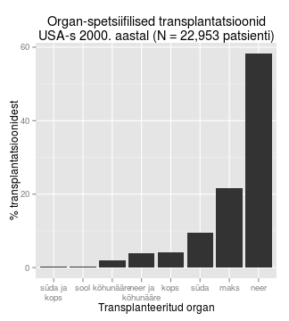

<!-- Limit image width and height -->

<!-- Center image on slide -->

<!-- Italic and Bold -->

--- .segue .dark .nobackground

## Recap

---

## Metastaasid

--- .segue .dark .nobackground

## Vähi immuunsus ja immuunoteraapia

---&twocol

## Vähi immuunoseire
# *Cancer immunosurveillance*

- 1909. aastal oletas saksa-juudi päritolu arst [Paul Ehrlich](http://en.wikipedia.org/wiki/Paul_Ehrlich) (1854-1915) et immuunsüsteem hoiab ära kartsinoomide tekke, mis vastasel juhul oleksid palju sagedasemad.
- Vähi immuunoseire hüpotees oletas, et tüümusest pärit rakud monitoorivad keha kudedes ka uusi transformeerunud rakke [Burnet FM, 1970](http://www.ncbi.nlm.nih.gov/pubmed/4921480).

***=right

***=left

<footer class="source">Pilt: wikipedia.
</footer>

---

## Vähi immuunokujundamine
# *Cancer immunoediting*

- Alternatiivseks hüpoteesiks vähirakkude ja immuunsüsteemi interaktsioonide kirjeldamiseks on **vähi immuunokujundamine**.
- Vähi **täielik elimineerimine immuunsüsteemi poolt** on immuunokujundamine üks stsenaarium. 
- Teine stsenaarium on **immuunsüsteemi poolt kujundatud vähirakkude** repertuaari esiletõus. 
- Immuunsüsteemiga kohandunud vähirakud on kas 
  - **vähem immuunogeneesed**,
  - suurenenud **võimega inhibeerida vähivastast immuunvastust**.

---

## Vähi immuunoseire/-kujundamine
# Vähi immuunoseire või -kujundamise toimimisele inimeses viitavad

- Kõrgem vähi intsidents immuunosupressiivset ravi saavatel organi transplantatsiooni läbinud patsientidel.
- Vähipatsientidel tekib oma vähi vastu immuunvastus.
- Vähisiseste tsütotoksiliste (CD8+) ja immuun-protektiivsete regulatoorsete (CD25+Foxp3+) T rakkude lokalisatsioon.

---&twocol

## Kõrgem vähi intsidents immuunosupressiivse ravi puhul

- Organi transplantatsiooni läbinud patsiendid saavad tugevat immuunosupressiivset ravi.

***=left

 
***=right

Nahavähi populatsioon-standardiseeritud intsidents organi transplantatsiooni patsientidel (Norra ja Holland).

Nahavähk | intsidentsi kasv
---------|-----------------
SCC	| 65-korda
huule SCC |	20-korda
BCC	| 10-korda
melanoom |	3.4-korda
Kapoosi sarkoom |	84-korda

<footer class="source">Graafik: Transplant Patient DataSource. United Network for Organ Sharing. Tabel: 
<a href="http://www.ncbi.nlm.nih.gov/pubmed/2316011">Hartevelt et al., 1990.
</a>
<a href="http://www.ncbi.nlm.nih.gov/pubmed/10642700">Jensen et al., 2000.
</a>
Lisaks: 
<a href="http://www.hudlaeknastodin.is/resources/Um-okkur/BS/Ca_Org_transpl.pdf">Lindelöf et al., 2000.
</a> ja 
<a href="http://www.sciencedirect.com/science/article/pii/S0190962202000117">Berg & Otley, 2002.
</a>
</footer>

---&twocol

## Immuunpuudulikel hiirtel tekib rohkem kasvajaid

***=right

***=left

- Metsik tüüpi või RAG2 -/- hiirtele süstiti naha alla 100 $\mu$g  kartsinogeenset 3-metüülkolantreeni (*methylcholanthrene*, MCA) ja jälgiti vähiteket.
- 160 päeva pärast oli 9/15 RAG2-/- hiirel moodustunud MCA-indutseeritud vähid, samas oli sama moodi indutseeritud vähk tekkinud ainult 2/15 wild-type hiirel.
- RAG2-/- hiirtel puuduvad T-, B- ja NK-T rakud.

<footer class="source">Pilt: IFNbig gamma and lymphocytes prevent primary tumour development and shape tumour immunogenicity.
<a href="http://www.nature.com/nature/journal/v410/n6832/full/4101107a0.html">
Shankaran et al., 2001.
</a>
</footer>

---&twocol

# Vähid mis tekivad hiires kellel puuduvad lümfotsüüdid on immunogeensemad

***=right

***=left

- Immuunopuudulikele RAG2-/- hiirtele või metsik tüüpi hiirtele transplanteeriti naha alla 100'000 vähirakku, mis pärinesid RAG2-/- või wt hiirtest eraldatud MCA-indutseeritud tuumoritest.
- Süngeensetest wt hiirtest pärit 17 erineva vähi rakud moodustasid tuumoreid 100% (17/17) wt hiirtes.
- RAG2-/- hiirtest pärit vähirakud (20  erinevast tuumorist) moodustasid tuumoreid ainult 40% juhtudest (8/20) kui neid transplanteeriti sama geneetilise tagapõhjaga imuunkompetentsetele hiirtele.

<footer class="source">Pilt: IFNbig gamma and lymphocytes prevent primary tumour development and shape tumour immunogenicity.
<a href="http://www.nature.com/nature/journal/v410/n6832/full/4101107a0.html">
Shankaran et al., 2001.
</a>
</footer>

---&twocol

## Immuunrakud kasvaja mikrokeskonnas

***=right

- T lümfotsüüdid
- B lümfotsüüdid
- NK ja NKT rakud
- makrofaagid
- müeloidset päritolu suppressor-rakud
- dendriitrakud
- neutrofiilid

***=left

<footer class="source">Pilt www.nature.com
</footer>

---&twocol

## Kasvajasse infiltreeruvad erinevad T-raku populatsioonid

***=left

- lokaliseeruvad kasvaja välispiirile
- lähimasse lümfisõlme
- kasvaja stroomasse - tsütotoksilised T-rakud
 
***=right
 

 

<footer class="source">Pilt: 
<a href="http://cancerres.aacrjournals.org/content/71/17/5670.long"> Halama et al. (2011).
</a>
</footer>

--- &twocol

## T-lümfotsüüdid 

***=left

- tsütotoksilised mälu T (CD8+CD45RO+),
- Th1 (partnerrakud: makrofaagid, CD8+ T),
- Th2 (partnerrakud: B, eosinofiilid, nuumrakud),
- Th17 või
- Treg rakkudeks

***=right

<footer class="source">Pilt: 
<a href="http://www.nature.com/nrc/journal/v12/n4/full/nrc3245.html"> Fridman et al., 2012.
</a>
</footer>

---

## Soolevähis on vähi T-rakud seotud hea prognoosiga
# Totaalne CD3+ T

<footer class="source">Pilt: B, valge tulp mitte-relapseeruv vähk, must tulp relapseerunud. 
<a href="http://www.sciencemag.org/content/313/5795/1960.full"> Galon et al., 2006.
</a>
</footer>

---

## Th1, CTL ja mälu-T

Anti-tumorigeensed - selgelt assotseeruvad hea prognoosiga

# TH1 
- produtseerivad IL-2 ja INF$\gamma$,
- toetavad kasvajale tsütotoksilisi CD8+ mälu T-rakke (CD8+CD45RO+).

# CTL 
- CD8+ tsütotoksilised T-rakud
- põhjustavad apoptoosi tsütotoksiliste graanulite (perforiin, granzyme) eritamise teel.

---

## Th2 & Th17

Enamasti kasvaja arengut võimendav effekt

 
# TH2
- produtseerivad IL-4, IL-5 ja IL-13 ja
- toetavad B-rakkude aktivatsiooni
- sekreteerivad immunosuppressiivset IL-10

# TH17
- TH17 polarisatsiooni indutseerivad TGF-$\beta$ ja IL-6
- IL-17A, IL17F, IL-21 ja IL-22
- bakteriaalse põletiku vastus

---&twocol

## Pahaloomulistes kasvajates on rohkem Th17 rakke

TH17-infiltreerumine on pahaloomulistes kasvajates tavaline:

***=left

- näo-lõualuu kasvajad, [Kesselring et al. (2010)](http://www.nature.com/bjc/journal/v103/n8/full/6605891a.html)
- rinnakasvajad, [Yang et al. (2011)](http://link.springer.com/article/10.1007/s12013-011-9276-3/fulltext.html)
- neerukasvajad, [Attig et al. (2009)](http://cancerres.aacrjournals.org/content/69/21/8412.full)
- glioomid, [Wainwright et al. (2010)](http://www.plosone.org/article/info%3Adoi%2F10.1371%2Fjournal.pone.0015390)
- medulloblastoomid, [Cantini et al. (2011)](http://link.springer.com/article/10.1007/s00262-011-1069-4/fulltext.html)

***=right

<footer class="source">Pilt: Cantini et al. (2011)
</footer>

--- &twocol

## Th17 pro-tumorigeensed mehhanismid
 
***=right

- **Angiogenees**: indutseerivad VEGF-i ekspressiooni.
- **Indutseerivad neutrofiilide invasiooni**
  - ECM-i lagundamine
  - immunosuppressioon.

***=left

<footer class="source">Pilt: 
<a href="http://www.bloodjournal.org/content/bloodjournal/101/7/2620.full.pdf?sso-checked=true"> Numasaki et al., 2002.
</a>
</footer>

---

## Immuunosuppressiivsed Treg rakud

Kõige sagedamini kirjeldatud pro-tumorigensete omadustega CD4+ rakud

 
- iseloomulik FOXP3 ja CD25 ekspressioon
- immuunosupressiivne funktsioon on vahendatud üle
    - TGF-$\beta$ ja IL-10 sekretsiooni ja
    - CTLA4-vahendatud kontaktinhibitsiooni.

<footer class="source">Pilt:
<a href="http://www.nature.com/nm/journal/v18/n5/fig_tab/nm.2731_F2.html">
Holgate, 2012.
</a>
</footer>

---

## Kasvaja immuunkontekst

<footer class="source">Pilt:
<a href="http://www.nature.com/nrc/journal/v12/n4/full/nrc3245.html">
Fridman et al., 2012.
</a>
</footer>

--- .segue .dark .nobackground

## Lingid eelmistele loengutele

--- &twocol 

***=left 

- [Sissejuhatav loeng](http://rpubs.com/tapa741/sissejuhatus)
- [Vähitüübid](http://rpubs.com/tapa741/vahityybid)
- [Onkoviirused](http://tpall.github.io/Onkoviirused)
- [Onkogeenid](http://tpall.github.io/Onkogeenid)
- [Retseptorid](http://tpall.github.io/Retseptorid)
- [Signaalirajad](http://tpall.github.io/Signaalirajad)
- [Tuumorsupressorgeenid](http://tpall.github.io/Tuumorsupressorid)
- [Rakutsüklikontroll](http://tpall.github.io/Rakutsyklikontroll)
- [p53 ja apoptoos](http://tpall.github.io/p53-ja-apoptoos)

***=right 

- [Immortalisatsioon](http://tpall.github.io/Immortalisatsioon)
- [Tumorigenees](http://tpall.github.io/Tumorigenees)
- [Genoomiterviklikkus](http://tpall.github.io/Genoomiterviklikkus)
- [Mikrokeskkond](http://tpall.github.io/Mikrokeskkond)
- [Metastaasid](http://tpall.github.io/Metastaas)
